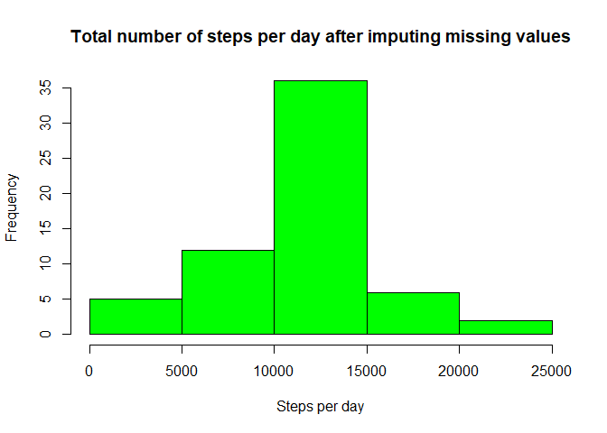

##Loading and preprocessing the data


```r
#Loading the data into Rstudio
rawdata <- read.csv("activity.csv")
goodData <- rawdata[complete.cases(rawdata),]

#Processing the data (changing date variable to date format)
rawdata$date <- as.Date(rawdata$date,"%Y-%m-%d")
goodData$date <- as.Date(goodData$date,"%Y-%m-%d")
```

##What is mean total number of steps taken per day?


```r
#Finding the total number of steps taken per day
dailySteps <- with(goodData,tapply(steps,date,sum))


#Plotting the total number of steps taken per day
hist(dailySteps,col="pink",main = "Total number of steps per day",xlab = "Steps per day")
```

<!-- -->

```r
#Calculating the mean and median of the total steps per day
mean <- round(mean(dailySteps),0)
median <- round(median(dailySteps),2)
```
The mean of the total number of steps taken per day is 10766
The median of the total number of steps taken per day is 10765

##What is the average daily activity pattern?


```r
#Finding and plotting the average number of the steps across all days for each interval
intAverage <- with(goodData,tapply(steps, interval, mean))

plot(names(intAverage),intAverage,col="blue",type = "l",main = "Average steps by 5-minute Interval",
     xlab = "Time intervals",ylab = "Average number of steps")
```

<!-- -->

```r
#Calculating the interval with maximum average steps
maxInt <- names(which.max(intAverage))
```
The 5-minute interval with maximum number of steps on average across all days is 835

##Imputing missing values (using the Mean of the 5-minute intervals)


```r
#Calculating the total number of missing values
sum(is.na(rawdata$steps))
```

```
## [1] 2304
```

```r
#Making a new dataset from rawdata but with missing values replaced with the mean across all days
#of the 5-interval it belongs to
newdata <- rawdata
for (i in 1:nrow(rawdata)) {
  if (is.na(rawdata$steps[i])) {
    int <- rawdata$interval[i]
    value <- as.numeric(intAverage[names(intAverage)==int])
    newdata$steps[i] <- value
  }
}

#Finding and plotting the total number of steps per day for new dataset
newdailySteps <- with(newdata,tapply(steps,date,sum))
hist(newdailySteps,col="green",main = "Total number of steps per day after imputing missing values",xlab = "Steps per day")
```

<!-- -->

```r
#Calculating the mean and median of the total steps per day for new dataset
newmean <- round(mean(newdailySteps),0)
newmedian <- round(median(newdailySteps),2)
```
The new mean of the total number of steps taken per day is 10766
The new median of the total number of steps taken per day is 10766.19

We can see that the mean and median has not changed from before. Hence, imputing missing values did NOT have any effect on the estimates.

##Are there differences in activity patterns between weekdays and weekends?


```r
library(lubridate)
```

```
## 
## Attaching package: 'lubridate'
```

```
## The following object is masked from 'package:base':
## 
##     date
```

```r
#Creating a new factor variable with weekend and weekday levels
newdata$dayType <- factor(wday(newdata$date))
levels(newdata$dayType) <- list("weekday"=c(2,3,4,5,6),"weekend"=c(1,7))

#Splitting the dataset to smaller datasets
Wdayset <- newdata[newdata$dayType=="weekday",]
Wendset <- newdata[newdata$dayType=="weekend",]

#Plotting weekend and weekday datasets in panels
par(mfrow=c(2,1))
DayintAve <- with(Wdayset,tapply(steps, interval, mean))
EndintAve <- with(Wendset,tapply(steps, interval, mean))

plot(names(EndintAve),EndintAve,col="orange",type = "l",main = "Weekend",
     xlab = "Time intervals",ylab = "Average number of steps",ylim = c(0,250))
plot(names(DayintAve),DayintAve,col="purple",type = "l",main = "Weekday",
     xlab = "Time intervals",ylab = "Average number of steps",ylim = c(0,250))
```

<!-- -->

We do see some minute changes in the average number of steps taken on weekdays and weekends. For example, the subject starts taking steps at a later time of the day and tends to take lesser number in the early intervals of time on the weekends as compared to the weekdays.
